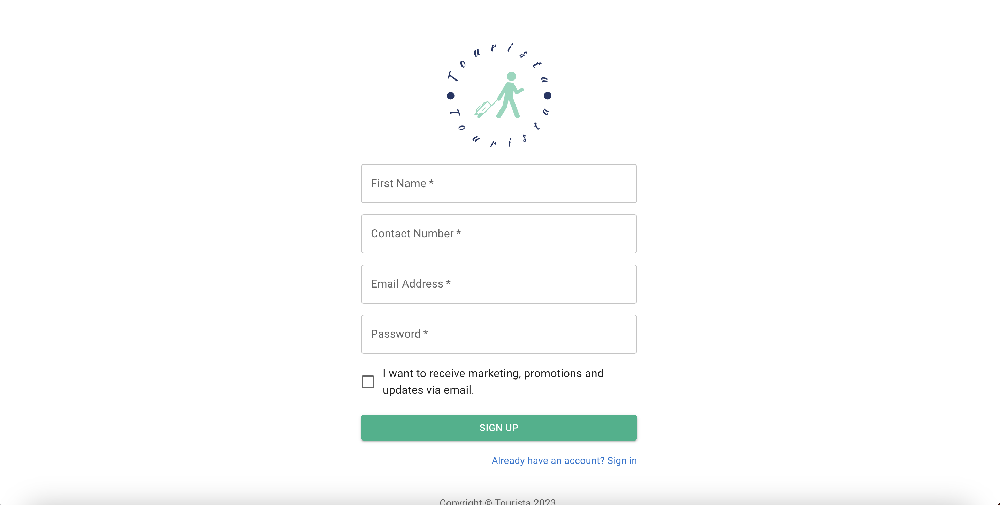
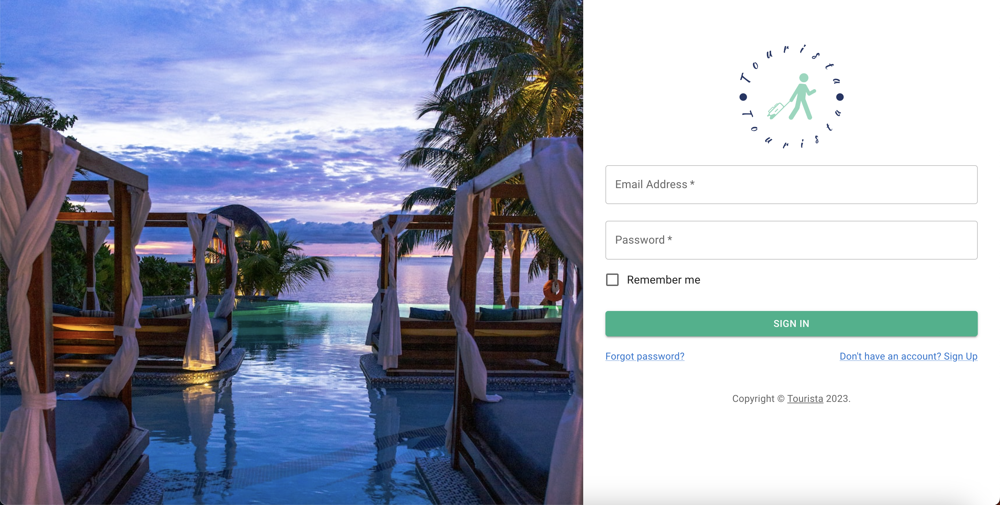

<h1 align="center">Tourista : Hotel Booking Platform</h1>

Discover <b>Tourista</b> - The ultimate hotel booking solution for your next adventure. Access a diverse range of accommodations, tailored to fit your needs and budget. Experience real-time availability, secure bookings, and authentic customer reviews. Plan your perfect stay with ease - Book now with <b>Tourista!</b>

 

  

  
<h2 align="center">Tech Stack</h2>

  
  
  
  

  <h3 align="center">Frontend : React</h3>
  <h3 align="center">Backend : Django</h3>
  <h3 align="center">Database : mySQL</h3>
  <h3 align="center">External Library : Material UI</h3>

  

<h2 align="center">Screenshots</h2>
  <h3 align="left">Signup Page</h3>
  
  <h3 align="left">Login Page</h3>
  
